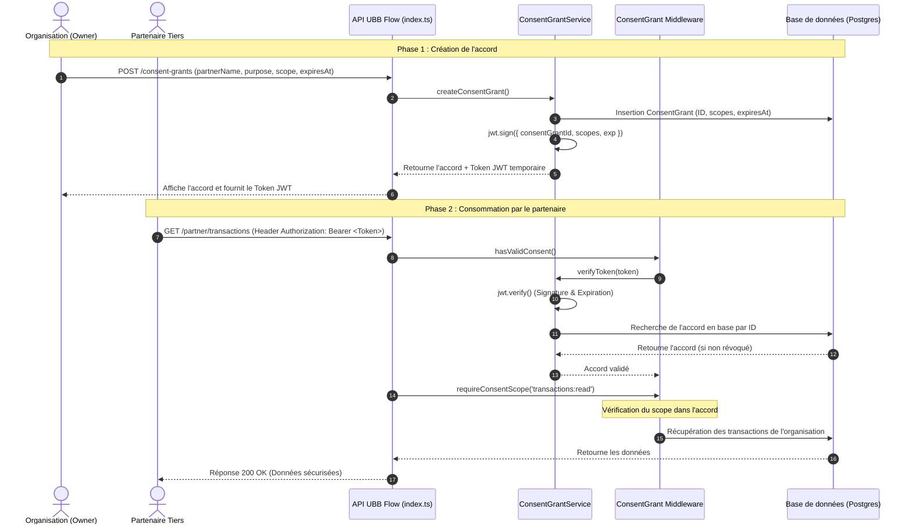

# Implémentation du Modèle ConsentGrant et Tokens Temporaires (JWT Signés)

Ce document résume la conception technique, l'architecture et les détails d'implémentation pour le modèle **ConsentGrant** et la création de tokens d'accès temporaires (JWT signés).

---

## 📐 Architecture Technique

Le système permet aux organisations de générer un accès temporaire et ciblé pour des tiers (partenaires, banques, auditeurs). L'accès est contrôlé par des scopes précis (`profile:read`, `transactions:read`, `trust:read`) et possède une date d'expiration exacte synchronisée entre la base de données et la signature du token JWT.



---

## 🛠️ Composants Créés et Modifiés

### 1. Service : [consent-grant.service.ts](file:///d:/UBB/UBBFlow/backend/src/services/consent-grant.service.ts)
Ce service encapsule :
- La création de l'accord en base de données.
- La génération du JWT avec une revendication d'expiration `exp` calquée sur la date `expiresAt` de l'accord.
- La vérification du JWT et sa validation en temps réel contre la base de données (si un accord est supprimé/révoqué en base, le JWT devient instantanément invalide, même s'il n'est pas expiré temporellement).

### 2. Middleware : [consent-grant.middleware.ts](file:///d:/UBB/UBBFlow/backend/src/middleware/consent-grant.middleware.ts)
- `hasValidConsent`: Intercepte le token d'autorisation du partenaire, valide sa structure, appelle le service de vérification et injecte l'accord dans `req.consentGrant`.
- `requireConsentScope(requiredScope)`: Un middleware paramétrable pour restreindre dynamiquement l'accès à un endpoint selon les privilèges associés au token.

### 3. Contrôleur et Routes Client : [consent-grant.controller.ts](file:///d:/UBB/UBBFlow/backend/src/controllers/consent-grant.controller.ts) & [consent-grant.routes.ts](file:///d:/UBB/UBBFlow/backend/src/routes/consent-grant.routes.ts)
Permettent aux utilisateurs de l'organisation de :
- Créer un accord de consentement (`POST /consent-grants`).
- Lister tous les accords actifs (`GET /consent-grants`).
- Révoquer immédiatement un accord (`DELETE /consent-grants/:id`).

### 4. Routes Partenaires : [partner.routes.ts](file:///d:/UBB/UBBFlow/backend/src/routes/partner.routes.ts)
Exposent les endpoints sécurisés par consentement pour les tiers :
- `GET /partner/profile` (nécessite le scope `profile:read`)
- `GET /partner/transactions` (nécessite le scope `transactions:read`)
- `GET /partner/trust-score` (nécessite le scope `trust:read`)

---

## 🧪 Rapport des Tests Automatiques End-to-End

Pour vérifier la robustesse absolue du code, nous avons conçu et exécuté un script d'intégration complet dans [test-consent-grant.ts](file:///d:/UBB/UBBFlow/backend/src/scripts/test-consent-grant.ts).

### Log d'exécution de la validation :
```bash
🚀 Running ConsentGrant end-to-end backend tests...
✅ Using organization: Ma Super Entreprise (ce61ee57-3b27-4764-80a2-aa56804c9c01)

--- Test 1: Create ConsentGrant & Generate signed JWT ---
✅ ConsentGrant database record created successfully!
  ID: 52245e84-48d6-4c92-b5b6-0e02c7569223
  Partner: CreditBank Cameroon
  Scope: profile:read transactions:read
  ExpiresAt: 2026-05-18T09:26:28.984Z
✅ Temporary signed access JWT generated successfully!
  Token: eyJhbGciOiJIUzI1NiIsInR5cCI6IkpXVCJ9.eyJ...

--- Test 2: Verify Token ---
✅ Token signature and database state verified!
  Verified ID: 52245e84-48d6-4c92-b5b6-0e02c7569223
  Verified OrgID: ce61ee57-3b27-4764-80a2-aa56804c9c01

--- Test 3: Scope validations ---
  Scope 'profile:read' allowed? ✅ Yes
  Scope 'transactions:read' allowed? ✅ Yes
  Scope 'trust:read' allowed? ❌ No
✅ Scope authorization works perfectly!

--- Test 4: List ConsentGrants ---
✅ ConsentGrant is listed correctly! (Total listed: 1)

--- Test 5: Revoke & Verify Token invalidation ---
✅ ConsentGrant revoked (deleted) successfully from database.
  Trying to verify the JWT of the revoked grant...
✅ Verification failed as expected: "Accord de consentement introuvable ou révoqué"

🎉 ALL TESTS PASSED SUCCESSFULLY! 🎉
```

---

## 🚀 Résumé des modifications Git

```diff:index.ts
import express from 'express'
import cors from 'cors'
import helmet from 'helmet'
import morgan from 'morgan'
import dotenv from 'dotenv'
import rateLimit from 'express-rate-limit'
import path from 'path'

dotenv.config()

const app = express()
const port = process.env.PORT || 5000

// Configuration du rate-limiting
const limiter = rateLimit({
  windowMs: 15 * 60 * 1000, // 15 minutes
  limit: 100, // Limite chaque IP à 100 requêtes par fenêtre de 15 minutes
  standardHeaders: 'draft-7', // Retourne les informations de limite dans les headers `RateLimit`
  legacyHeaders: false, // Désactive les headers `X-RateLimit-*`
})

const allowedOrigins = [
  'http://localhost:5173',
  'http://localhost:5174',
  'https://ubb-flow-trust-frontend.vercel.app',
  'https://www.ubb-flow-trust-frontend.vercel.app'
]

app.use(cors({
  origin: (origin, callback) => {
    // allow requests with no origin (like mobile apps or curl requests)
    if (!origin) return callback(null, true)
    
    if (allowedOrigins.indexOf(origin) === -1) {
      const msg = 'The CORS policy for this site does not allow access from the specified Origin.'
      return callback(new Error(msg), false)
    }
    return callback(null, true)
  },
  credentials: true
}))
app.use(helmet())
app.use(morgan('dev'))
app.use(express.json())
app.use(limiter)

// Routes
import authRoutes from './routes/auth.routes.js'
import accountRoutes from './routes/account.routes.js'
import transactionRoutes from './routes/transaction.routes.js'
import uploadRoutes from './routes/upload.routes.js'
import analyticsRoutes from './routes/analytics.routes.js'
import budgetRoutes from './routes/budget.routes.js'
import recurringRuleRoutes from './routes/recurring-rule.routes.js'
import alertRoutes from './routes/alert.routes.js'
import profileRoutes from './routes/profile.routes.js'
import documentRoutes from './routes/document.routes.js'
import trustRoutes from './routes/trust.routes.js'
import complianceRoutes from './routes/compliance.routes.js'

app.use('/auth', authRoutes)
app.use('/accounts', accountRoutes)
app.use('/transactions', transactionRoutes)
app.use('/upload', uploadRoutes)
app.use('/analytics', analyticsRoutes)
app.use('/budgets', budgetRoutes)
app.use('/recurring-rules', recurringRuleRoutes)
app.use('/alerts', alertRoutes)
app.use('/profile', profileRoutes)
app.use('/documents', documentRoutes)
app.use('/trust', trustRoutes)
app.use('/compliance', complianceRoutes)

// Serve local static uploads if STORAGE_TYPE=local
if (process.env.STORAGE_TYPE === 'local' || !process.env.STORAGE_TYPE) {
  const uploadPath = path.join(process.cwd(), 'uploads')
  app.use('/uploads', express.static(uploadPath))
  console.log(`[storage]: Serving local files from ${uploadPath}`)
}

app.get('/health', (req, res) => {
  res.json({ status: 'OK', timestamp: new Date().toISOString() })
})

// Initialize Cron Jobs
import { CronService } from './services/cron.service.js'
CronService.init()

app.listen(port, () => {
  console.log(`[server]: Server is running at http://localhost:${port}`)
})
===
import express from 'express'
import cors from 'cors'
import helmet from 'helmet'
import morgan from 'morgan'
import dotenv from 'dotenv'
import rateLimit from 'express-rate-limit'
import path from 'path'

dotenv.config()

const app = express()
const port = process.env.PORT || 5000

// Configuration du rate-limiting
const limiter = rateLimit({
  windowMs: 15 * 60 * 1000, // 15 minutes
  limit: 100, // Limite chaque IP à 100 requêtes par fenêtre de 15 minutes
  standardHeaders: 'draft-7', // Retourne les informations de limite dans les headers `RateLimit`
  legacyHeaders: false, // Désactive les headers `X-RateLimit-*`
})

const allowedOrigins = [
  'http://localhost:5173',
  'http://localhost:5174',
  'https://ubb-flow-trust-frontend.vercel.app',
  'https://www.ubb-flow-trust-frontend.vercel.app'
]

app.use(cors({
  origin: (origin, callback) => {
    // allow requests with no origin (like mobile apps or curl requests)
    if (!origin) return callback(null, true)
    
    if (allowedOrigins.indexOf(origin) === -1) {
      const msg = 'The CORS policy for this site does not allow access from the specified Origin.'
      return callback(new Error(msg), false)
    }
    return callback(null, true)
  },
  credentials: true
}))
app.use(helmet())
app.use(morgan('dev'))
app.use(express.json())
app.use(limiter)

// Routes
import authRoutes from './routes/auth.routes.js'
import accountRoutes from './routes/account.routes.js'
import transactionRoutes from './routes/transaction.routes.js'
import uploadRoutes from './routes/upload.routes.js'
import analyticsRoutes from './routes/analytics.routes.js'
import budgetRoutes from './routes/budget.routes.js'
import recurringRuleRoutes from './routes/recurring-rule.routes.js'
import alertRoutes from './routes/alert.routes.js'
import profileRoutes from './routes/profile.routes.js'
import documentRoutes from './routes/document.routes.js'
import trustRoutes from './routes/trust.routes.js'
import complianceRoutes from './routes/compliance.routes.js'
import consentGrantRoutes from './routes/consent-grant.routes.js'
import partnerRoutes from './routes/partner.routes.js'

app.use('/auth', authRoutes)
app.use('/accounts', accountRoutes)
app.use('/transactions', transactionRoutes)
app.use('/upload', uploadRoutes)
app.use('/analytics', analyticsRoutes)
app.use('/budgets', budgetRoutes)
app.use('/recurring-rules', recurringRuleRoutes)
app.use('/alerts', alertRoutes)
app.use('/profile', profileRoutes)
app.use('/documents', documentRoutes)
app.use('/trust', trustRoutes)
app.use('/compliance', complianceRoutes)
app.use('/consent-grants', consentGrantRoutes)
app.use('/partner', partnerRoutes)

// Serve local static uploads if STORAGE_TYPE=local
if (process.env.STORAGE_TYPE === 'local' || !process.env.STORAGE_TYPE) {
  const uploadPath = path.join(process.cwd(), 'uploads')
  app.use('/uploads', express.static(uploadPath))
  console.log(`[storage]: Serving local files from ${uploadPath}`)
}

app.get('/health', (req, res) => {
  res.json({ status: 'OK', timestamp: new Date().toISOString() })
})

// Initialize Cron Jobs
import { CronService } from './services/cron.service.js'
CronService.init()

app.listen(port, () => {
  console.log(`[server]: Server is running at http://localhost:${port}`)
})
```
